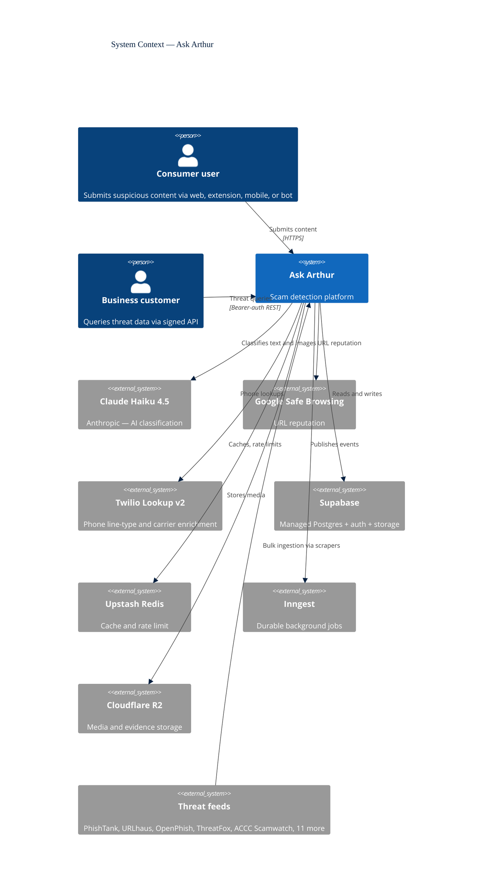
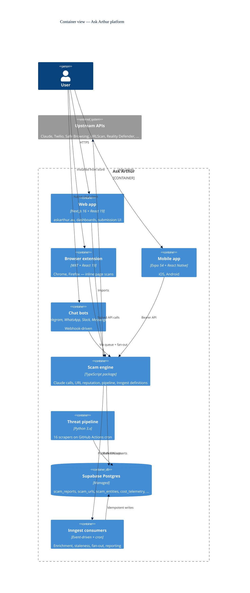
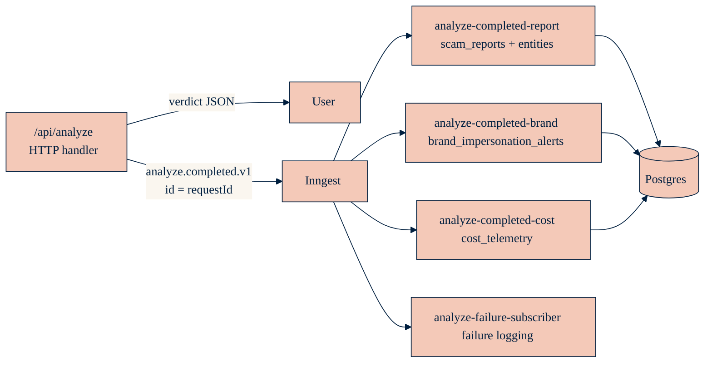

# How Ask Arthur Works: From Submission to Verdict

_A deep dive into the architecture of an Australian scam detection platform — the submission pipeline, the verdict engine, the threat-intel moat, and the five things I'd change tomorrow if I had the time._

---

Every month, Australians lose about $40 million to scams. The Australian Competition and Consumer Commission's Scamwatch logs roughly 25,000 reports in the same window, and the real number is higher — most people don't report. Ask Arthur exists because that gap, between "I got a weird text and I'm not sure" and "I actually checked and it was a scam," is where most of the damage gets done.

Users submit suspicious content — a text message, a URL, an image of a Facebook ad, a WhatsApp forward — through a web app, a browser extension, a mobile app, or one of four chat bots. The platform returns a verdict in a few seconds: `SAFE`, `SUSPICIOUS`, `HIGH_RISK`, or `UNCERTAIN`, with an explanation a non-technical user can act on.

This post walks through what happens in those few seconds, and what the rest of the system does on either side of that request. It's aimed at engineers who want to understand how the pieces fit, and at customers and partners who want to understand what we're actually doing with their data. I'll also call out the parts of the stack I'd improve tomorrow if I had another engineer on the team. You don't build a platform like this without accumulating debt.

## The 30-second tour

At the highest level, Ask Arthur has four surfaces users can touch, one AI model that does classification, a handful of third-party APIs that do enrichment, a Postgres database that stores everything, and a small army of Python scrapers that pull threat intelligence from 16 external feeds.

One level down, Ask Arthur itself is a monorepo with three user-facing apps and seven shared packages, plus a Python pipeline and a set of durable Inngest functions.

If you remember two things about this stack: **the request path is kept short and fast, and everything slow or retryable is pushed onto Inngest**. The rest of the post is that sentence, elaborated.

## Part 1 — the submission

The most interesting surface is `/api/analyze`, the single HTTP endpoint that the web app, the extension, and the mobile app all talk to when a user submits something. The route is about 600 lines of TypeScript. It does 12 things, in a strict order, and the order matters.

Here's what happens between a user tapping "check this" and the verdict appearing on screen:

1. **IP extraction.** We pull the client IP from `x-real-ip` (Vercel-provided), with `cf-connecting-ip` and `x-forwarded-for` as fallbacks. If we can't determine an IP in production, we fail closed — the request is rejected. In development we fail open so local work isn't blocked.
2. **Request-ID correlation.** The client may supply an `Idempotency-Key` header (Stripe-style, 8–255 chars, ULID recommended). If present, we use it. If absent, we generate a ULID. Either way, we echo it back as `X-Request-Id` on the response. This ID threads through the entire rest of the system — it becomes the Inngest event ID, it lands in `scam_reports.idempotency_key`, and it's the join key between the front-end trace, the API log, and the database row.
3. **Rate limit.** Two tiers, both sliding-window, both backed by Upstash Redis: 3 checks per hour (burst) and 10 checks per day (daily ceiling). Keyed on `hashIdentifier(ip, userAgent)` so a shared office IP doesn't penalise everyone behind it too aggressively.
4. **Payload-size guard.** Bodies above 10 MB are rejected with a 413 before we try to parse anything.
5. **Input validation.** The body is parsed by a Zod 4 schema (`WebAnalyzeInputSchema`). Anything that doesn't match the shape is a 400.
6. **Image magic-byte sniff.** If the user uploaded images, we check the first few bytes match a real image header. This catches a classic attack: uploading a file with `.jpg` in the name that's actually an HTML payload, hoping a downstream viewer renders it.
7. **Prompt-injection detection.** Before we hand anything to Claude, a pre-filter runs the text through 14 regex patterns (NFKC-normalised first, so Unicode lookalikes don't sneak past). Things like "ignore previous instructions", "you are now DAN", zero-width characters in the middle of directives. A positive match doesn't block the request — it _floors the verdict to `SUSPICIOUS`_, regardless of what Claude says later. Defence in depth: the model is _part_ of the defence, not the whole of it.
8. **Cache lookup.** Text-only submissions get hashed and checked against an Upstash cache. Same text, same verdict, no Claude call. Cache TTL varies by verdict: `SAFE` caches longer than `HIGH_RISK`, because a URL going from "clean" to "weaponised" is common, and you don't want stale "safe" verdicts hiding a new attack.
9. **Geolocation.** Pulled synchronously from Vercel's request headers (`x-vercel-ip-city`, `x-vercel-ip-country-region`). Used for AU/non-AU context in the prompt and for regional scam clustering.
10. **URL extraction and reputation.** We extract URLs from the text, check each against Google Safe Browsing, and — behind a feature flag — resolve redirect chains to catch the old trick of wrapping a malicious URL in a shortener.
11. **Parallel AI analysis.** Claude Haiku 4.5 runs _in parallel_ with the URL reputation checks. Timeout: 30 seconds for vision requests, 15 for text-only. Haiku 4.5 is our model because it's the price/latency sweet spot for classification with vision — Opus would be overkill and six times the cost.
12. **Verdict merging and phone intelligence.** We merge the AI verdict with the URL reputation result (escalate to `HIGH_RISK` if any URL was flagged), apply the injection floor if triggered, and — only for `HIGH_RISK` or `SUSPICIOUS` — call Twilio Lookup v2 for any phone numbers we found. We don't burn $0.018 on a phone lookup for something already verdicted `SAFE`.

The response fires back with the verdict, the red flags, recommended next steps, and the `X-Request-Id` header. The user sees the answer typically within two to four seconds — most of it is the Claude round trip.

## Part 2 — what happens after you send the response

If the request path stopped at "send the response", a lot of valuable things would not happen: the report would not be stored for aggregate threat intelligence, the cost of the Claude call would not be logged, brand impersonation signals would not be written into the alerts table, and the entity graph (URLs, phones, emails linked to this report) would not be updated.

The naive approach is to do all of that inside the request handler, usually hidden behind `waitUntil` so the response goes out before the writes finish. That works until it doesn't. Vercel's function timeout is 30 seconds. A single submission can trigger writes to four or five tables. Any one of them failing halfway through leaves you with inconsistent state and no clear recovery path.

The better approach, and the one we've moved to, is to publish a single event — `analyze.completed.v1` — and let durable, retryable consumers do the rest. This is gated behind a feature flag (`FF_ANALYZE_INNGEST_WEB`) so we can roll it back with an env var change, but in practice it's on.

Each consumer is independently retryable. Each is idempotent, because the event ID is the request ID, and the Postgres RPCs use `ON CONFLICT` on a partial unique index over `idempotency_key`. Any of them can fail and retry and the end state is identical.

That idempotency property is load-bearing, and it's worth spending a minute on.

## A short detour: three-tier idempotency

"Make it idempotent" is one of those phrases that sounds like good advice until you try to implement it, at which point you discover it means different things at different layers. For Ask Arthur, the request flow has three layers and three separate implementations:

1. **The HTTP layer.** The client sends `Idempotency-Key`. If a retry lands on the API before the original has finished, the route has a place to stand — same ID, same treatment. This is the Stripe pattern.
2. **The Inngest layer.** The event is published with `id: requestId`. Inngest deduplicates events by ID within a 24-hour window. Each consumer function _also_ declares `idempotency: "event.data.requestId"`. That means even if the platform re-delivers (network blips, at-least-once semantics), each consumer runs at most once per request ID.
3. **The database layer.** The `scam_reports` table has an `idempotency_key` column added in migration v73, with a partial unique index that ignores legacy NULL keys. The `create_scam_report` RPC uses `ON CONFLICT (idempotency_key) DO UPDATE ... RETURNING id`, so a duplicate insert returns the original row's ID without a second row ever being created.

Each layer handles the failure mode of the layer above. Client retries are caught at HTTP. Inngest re-delivery is caught at the event layer. A bug in our own Inngest function that somehow runs twice despite deduplication is caught at the database. Belt, braces, and a second belt.

This felt like overkill when I built it. Three weeks later it caught a bug where a retried upload was silently creating duplicate rows, and I stopped feeling that way.

## Part 3 — the threat intelligence layer

The Claude call is the visible part of the verdict, but it's not the thing that makes verdicts credible. The thing that makes verdicts credible is having 164,000 malicious URLs and 140,000 malicious IPs to cross-reference against, many of them updated within the hour.

That data comes from 16 Python scrapers, one per feed source, running on GitHub Actions cron. Each scraper is a few hundred lines of Python that fetches its source, normalises URLs and IPs (same domain with `www.`, trailing slash, uppercase hostname, etc. all collapse to one canonical form), deduplicates against the existing database, and batches 500 records at a time into a Postgres RPC call.

The feeds we currently ingest:

| Source                            | Type            | What it gives us                 |
| --------------------------------- | --------------- | -------------------------------- |
| PhishTank                         | Community DB    | Community-reported phishing URLs |
| URLhaus                           | Malware hosting | Malware distribution URLs        |
| OpenPhish                         | API             | Active phishing URLs             |
| PhishStats                        | API             | Phishing URL statistics          |
| PhishingDatabase                  | Feed            | Phishing URLs                    |
| Phishing Army                     | Blocklist       | Curated phishing domains         |
| CryptoScamDB                      | List            | Crypto scam hosts                |
| ThreatFox                         | IOCs            | Malware and C2 indicators        |
| Feodo Tracker                     | C2 IPs          | Botnet command-and-control       |
| Spamhaus DROP/EDROP               | Blocklists      | Email and IP blocklists          |
| AbuseIPDB                         | Reports         | Malicious IP reports             |
| IPSUM                             | List            | Proxy and abuse IPs              |
| ACCC Scamwatch RSS                | Advisory        | Australian government advisories |
| CERT Australia                    | Advisory        | AU vulnerability notices         |
| Certificate Transparency (crt.sh) | Cert history    | Brand-impersonation detection    |
| Reddit r/scams                    | Community       | Community-reported scams         |

Each entry in `scam_urls` remembers which feed saw it and when. When a user submission matches a URL that's also in, say, URLhaus and PhishTank, we have strong corroboration. When a URL has never been seen before, that's a different kind of signal — novel isn't necessarily malicious, but it means Claude is our only line of defence and we weight accordingly.

On top of that, a small number of Inngest cron jobs enrich entries after ingestion — WHOIS lookups, SSL certificate introspection, URLScan.io screenshots for high-risk entries, Certificate Transparency monitoring for AU bank brand impersonation. None of it is on the request path. All of it is idempotent and retryable.

## Part 4 — the bot fleet

Ask Arthur runs on Telegram, WhatsApp, Slack, and Messenger. Each platform has its own webhook, its own signature scheme, its own message format, and its own idea of what "rich content" means.

The obvious engineering move is to build a single abstract "bot message" type and format it per platform on the way out. I didn't do that. Each platform gets its own formatter:

- `toTelegramMessage()` — HTML, inline keyboard buttons
- `toWhatsAppMessage()` — markdown, limited formatting
- `toSlackMessage()` — Block Kit JSON with rich layouts
- `toMessengerMessage()` — plain text, no formatting at all

The trade-off: more code to maintain, but zero impedance mismatch. Telegram gets proper HTML lists and bold tags. Slack gets blocks with buttons and accessory buttons and expand/collapse. Messenger, which supports nothing, doesn't try to fake anything. If I had written a unified abstraction, every platform would have been clipped to the feature set of the weakest one, and the Block Kit integration would have been a mess of escape hatches.

The dispatch path for bot messages is also deliberately different from the web path. Bots have bursty traffic — a news cycle about a particular scam can send a thousand messages into Telegram in an hour. Handling those synchronously inside the webhook handler risks hitting the platform's webhook timeout and starting a retry storm.

Instead:

1. Bot webhook lands on `/api/webhooks/{platform}`, verifies the signature, and inserts a row into `bot_message_queue` with `status = 'pending'`.
2. A Supabase Database Webhook on that table fires via `pg_net` (unmetered on Supabase Pro) and calls `/api/bot-webhook`.
3. `/api/bot-webhook` does an atomic claim: `UPDATE bot_message_queue SET status = 'processing' WHERE id = $1 AND status = 'pending'`. If the update returns zero rows, another instance got there first and we no-op.
4. If the claim succeeded, we run the analysis, format it per platform, and send the reply.
5. A safety sweeper cron job runs every 10 minutes to catch anything that `pg_net` failed to fire for (rare, but it happens).

Event-driven, not polling. Safe-by-default, not safe-if-you-remember.

## The extension's identity problem

Browser extensions have a specific problem that's unlike anything else in the stack. They run in the user's browser, so they can't hold a server-side secret. They're distributed through the Chrome Web Store, so anyone can unpack the CRX and read every string in the bundle. And Google killed Web Environment Integrity in 2023, so there's no supported way for the extension to prove to a server that it's actually the store-installed version.

If you bake a shared API key into the extension, it's extracted and on Github within an hour of your first release. If you require the user to log in, adoption collapses.

We solved this with ECDSA P-256 keypairs:

1. On first run, the extension generates an ECDSA P-256 keypair using `crypto.subtle.generateKey(..., extractable: false, ...)`. The private key is a `CryptoKey` object — not a string, not JSON, not anything extractable. It's stored in IndexedDB, which survives Manifest V3's aggressive service-worker recycling.
2. An offscreen document iframes Turnstile (Cloudflare's CAPTCHA) and forwards the token to `/api/extension/register`, which verifies the token, accepts the public key, and stores it in the `extension_installs` table along with a random install ID.
3. Every subsequent API call is signed. The canonical message is `${METHOD}\n${PATH}\n${TIMESTAMP}\n${NONCE}\n${BASE64(SHA256(BODY))}`. The signature, the install ID, the timestamp, and the nonce go in request headers. The server verifies the signature against the stored public key, rejects anything more than five minutes out of clock sync, and uses an Upstash SETNX to burn the nonce so replays fail.

The attacker's best case is stealing the entire user profile — at which point they _are_ the user. That's acceptable.

## Part 5 — the things I'd change tomorrow

I'd be doing a disservice to anyone using this post as a reference if I pretended the stack was finished. Here are the nine things that are missing or undercooked, roughly in the order I'd fix them.

**1. End-to-end test coverage.** We have unit tests for the utilities and a decent amount of integration testing around the analyse pipeline, but no browser-based or mobile E2E suite. Which means a regression that corrupts the submission flow — a Zod schema change that breaks the extension, say — could ship on a clean `pnpm turbo build` and we'd find out from user complaints. Playwright for the web and extension, Maestro or Detox for mobile. A week's work to bootstrap, ongoing discipline to keep useful.

**2. Database hygiene debt.** The April 2026 Supabase advisor audit flagged 177 unused indexes, 21 empty partitioned shadow tables from an earlier refactor, 16 overly-permissive RLS policies (`USING (true)` where they should be scoped), multiple-permissive-policy conflicts on a handful of tables, and `pg_trgm` sitting in the public schema where it shouldn't be. All tracked in `BACKLOG.md`. None of it is urgent. All of it is the sort of thing that makes a future migration painful.

**3. Prompt versioning infrastructure.** The system prompt is a hardcoded string behind a `PROMPT_VERSION` constant. We can change it, but we can't A/B test it, can't attribute a cohort of verdicts to a specific prompt version for analysis, and can't evaluate a candidate prompt against historical submissions before shipping. A lightweight eval framework — submissions + known verdicts, run them through prompt v1 vs v2, compare — would pay for itself inside a month.

**4. Observability gaps.** We have structured logs (with PII masking) and the `cost_telemetry` table, which catches most cost-related incidents quickly. What we don't have is APM, distributed tracing, or a real error-tracking integration. If an Inngest consumer silently fails to write a scam report, the cost-drop alert may catch it before a human does, but the root-cause investigation is all grep. Sentry for errors, OpenTelemetry traces threaded through the `X-Request-Id` header, some form of APM for p95 latency visibility on the analyse route.

**5. Phase 2b — the last inline write.** `storeVerifiedScam`, which writes the highest-confidence `HIGH_RISK` submissions into a permanent record, still runs inline via `waitUntil`. It hasn't moved to Inngest yet because verified scams can carry image evidence, and we haven't finalised the R2 staging design that lets an Inngest function consume a blob the user uploaded ten seconds ago without re-uploading it. This is a week of design work we keep deferring.

**6. Disaster recovery procedures.** Supabase gives us point-in-time recovery. What we don't have is a rehearsed runbook. The difference between "we have backups" and "we can restore in under an hour" is a Saturday morning spent doing the restore on a test project and writing down every surprising step.

**7. Feature flag lifecycle.** We have roughly 40 feature flags, and more accumulate every month. None of them auto-expire. Some of them — flags that went fully on six months ago and the legacy branch never got deleted — are now deadwood that any junior engineer reading the code has to reason about unnecessarily. A simple quarterly "this flag has been fully on for 90 days, delete the legacy branch" process would solve most of it.

**8. Single-telco dependency.** Our phone intelligence is Twilio Lookup v2. We've built the schema and feature flags for a Vonage migration (migrations v75 and v76) but the migration hasn't shipped. Until it does, a Twilio pricing change or outage is a direct product problem.

**9. Single-region architecture.** Everything runs in `ap-southeast-2` (Sydney). This is fine for an Australian product, but if the roadmap includes ASEAN — which it probably should — multi-region Postgres and edge-aware routing aren't trivial retrofits. Better to make the architectural calls _before_ the rewrite is forced.

None of these are blockers. All of them are the kind of technical debt that gets cheaper to pay off the earlier you do it.

## What this all adds up to

Ask Arthur is a boring stack, by design. Next.js on Vercel, Supabase for Postgres, Upstash for Redis, Inngest for background jobs, Claude for the hard classification call, Python for the threat-feed scrapers, and enough glue to make it feel like one product. The interesting parts aren't the individual components — none of them are novel. The interesting parts are the decisions about _where_ each piece of work happens:

- **The request path is short and fast.** Nothing slow or retryable blocks the response.
- **The verdict is defence in depth.** AI is one signal, URL reputation is another, prompt-injection pre-filter is a third, and the pre-filter _floors the verdict_ regardless of the model's opinion.
- **Idempotency is a property of the system, not a library.** Three layers, each covering the failure mode of the layer above.
- **Per-platform code where the platforms genuinely differ.** Unified abstractions are valuable when they simplify; they're a liability when the abstraction has to erase real differences.
- **Cost is a first-class signal.** Every paid API call is logged at the point of invocation, summarised daily, and alerted on when it breaches a threshold.

The product gets better when the data gets better, and the data gets better when more people use it. The architecture has to stay out of the way of that loop. When a new feed goes live, it should be a half-day of Python, not a week of refactoring. When a new scam type emerges, we should be able to try a new prompt in an afternoon. Most of the work I do on this stack is keeping those feedback loops fast.

If you work on something similar — or if you have opinions about any of the nine things I'd change tomorrow — I'd like to hear from you.

_Ask Arthur is askarthur.au. The platform is Australian and the data stays Australian. If you're a scam victim, report it to Scamwatch. If you're a business that needs threat intelligence, we have a B2B API._
