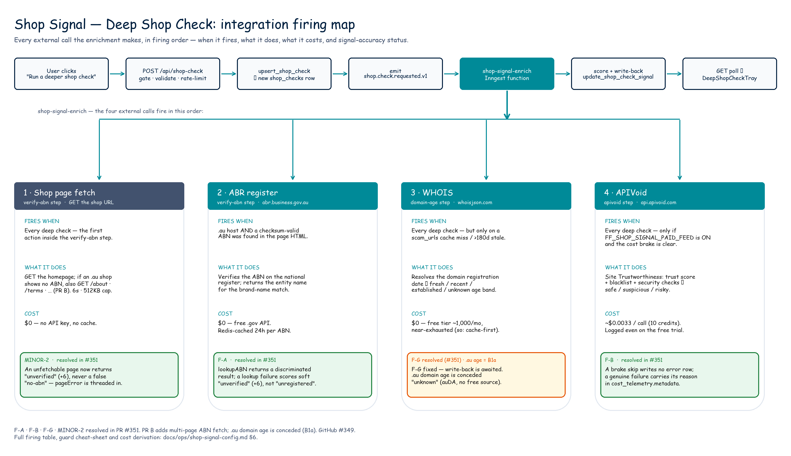

# Shop Signal — Operational Config Checklist

**Purpose.** Single source of truth for every env var, feature flag, paid
API provisioning step, cost-brake row, and pre-flip checklist that Shop
Signal depends on. If a flag needs flipping, a vendor key needs setting,
or the daily cap needs raising — it goes here.

Referenced from [CLAUDE.md](../../CLAUDE.md) Quick Reference and from
`docs/plans/shop-guard-v2.md` §4. Keep updated each PR.

> **Status (2026-05-22)** — Stage 0/0.5 (#324/#325) live; `FF_SHOP_SIGNAL`
> ON. Stage 1 PR A (#320, `shop_checks` schema) + PR B (#319, APIVoid
> adapter + cost brake) + the **Deep Shop Check** (reworked #321, **PR
> #339**) all merged and prod-verified. The Deep Shop Check is a
> user-initiated enrichment that calls APIVoid + ABN verification + WHOIS
> domain age from the `shop-signal-enrich` Inngest function on an explicit
> "Run a deeper shop check" click. Migration v137 applied;
> `FF_SHOP_SIGNAL_PAID_FEED` is **ON in prod** so the APIVoid leg runs (the
> deep check still completes on ABN + domain-age alone when it is OFF).
> Day-31 (~2026-06-19) is the APIVoid paid-tier renew decision. Open
> follow-ups: **#349**. See [`docs/adr/0008-shop-signal-deep-check-user-initiated.md`](../adr/0008-shop-signal-deep-check-user-initiated.md).

**Status legend**

| Marker | Meaning                           |
| ------ | --------------------------------- |
| ✅     | Live / configured / shipped       |
| ⏳     | In progress this sprint           |
| ❌     | Not started                       |
| 🔒     | Blocked — waiting on external dep |

---

## 1. Feature flags

All Shop Signal flags default **OFF** in production. They gate
orthogonal subsystems so each one can be flipped after its own gate
clears.

| Flag (env var)                      | Type            | Default | Status | Gates                                                                                                                                                                                                                                                                                                              | Flip when                                                                                                                                 |
| ----------------------------------- | --------------- | ------- | ------ | ------------------------------------------------------------------------------------------------------------------------------------------------------------------------------------------------------------------------------------------------------------------------------------------------------------------ | ----------------------------------------------------------------------------------------------------------------------------------------- |
| `FF_SHOP_SIGNAL`                    | server          | `false` | ✅     | Master switch. When `false`, the analyze pipeline's commerce-signal branch short-circuits before `detectCommerceSignal()` runs and `AnalysisResult.shopSignal` is absent on every response. When `true`, the pure detector + Claude red-flag post-processor run on every URL-bearing / commerce-text-shaped input. | After this PR merges. Starts the 30-day Stage-0 measurement window. **Step D of the pre-launch tidy plan.**                               |
| `FF_SHOP_SIGNAL_PAID_FEED`          | server          | `false` | ✅     | The APIVoid leg of the Deep Shop Check (#339). When OFF, `shop-signal-enrich` skips APIVoid and the deep check completes on ABN + domain-age alone. Independent of `FF_SHOP_SIGNAL`.                                                                                                                               | Done — ON in prod since 2026-05-20 (trial key in Vercel env). Day-31 (~2026-06-19) is the paid-tier renew decision.                       |
| `NEXT_PUBLIC_FF_SHOP_GUARD_B2B_API` | consumer        | `false` | ❌     | `/api/v1/shop-check` route (Stage 2 PR 5). When off, the route returns 503.                                                                                                                                                                                                                                        | Stage-1 measurement target clears (≥80% detection on AU adversarial corpus, ≤2% FP on real traffic).                                      |
| `WXT_SHOP_GUARD`                    | extension build | `false` | ❌     | Extension popup + `SHOW_SHOP_SIGNAL_VERDICT` handler in `url-guard.content.ts` (Stage 2 PR 6). Build-time flag — bundling decision, not runtime.                                                                                                                                                                   | Same gate as `NEXT_PUBLIC_FF_SHOP_GUARD_B2B_API`. Extension `<all_urls>` host permission stays gated on activation data (PR 7, separate). |

**Rollout order (recommended):**

1. `FF_SHOP_SIGNAL` (Stage 0 — runs detector + post-processor, free-only,
   stamps `shopSignal` onto `AnalysisResult` and `scam_reports.analysis_result`)
2. `FF_SHOP_SIGNAL_PAID_FEED` (Stage 1 — adds APIVoid trust-score)
3. `NEXT_PUBLIC_FF_SHOP_GUARD_B2B_API` (Stage 2 — exposes B2B endpoint)
4. `WXT_SHOP_GUARD` (Stage 2 — extension build, separately from B2B)

Flipping `FF_SHOP_SIGNAL` without the others is the **whole point of
Stage 0** — it runs the free-only detector + post-processor for 30 days
to validate the value-prop threshold before any paid spend.

---

## 2. Environment variables

| Var                            | Stage       | Status | Where set                                       | Notes                                                                                                                                                                                                        |
| ------------------------------ | ----------- | ------ | ----------------------------------------------- | ------------------------------------------------------------------------------------------------------------------------------------------------------------------------------------------------------------ |
| `FF_SHOP_SIGNAL`               | Stage 0     | ✅     | Vercel → Production + Preview                   | Flipped ON 2026-05-20 — Stage-0 measurement window open.                                                                                                                                                     |
| `FF_SHOP_SIGNAL_PAID_FEED`     | Stage 1     | ✅     | Vercel → Production + Preview                   | ON in prod since 2026-05-20. Enables the deep check's APIVoid leg; the deep check still completes on ABN + domain-age when OFF.                                                                              |
| `APIVOID_API_KEY`              | Stage 1     | ✅     | Vercel → server-only (no `NEXT_PUBLIC_` prefix) | 30-day trial key added to Vercel + `.env.local` 2026-05-20. Rotates via Vercel re-set; no Supabase secrets table involvement.                                                                                |
| `SHOP_SIGNAL_CAP_USD`          | Stage 1     | ⏳     | Vercel → Production + Preview                   | Optional — `cost-daily-check` defaults to `15` if unset. **Use bare number** (`15`, not `$15` — `parseFloat("$15") === NaN` silently disables the brake). See §3 for cap derivation.                         |
| `NEXT_PUBLIC_PLAUSIBLE_DOMAIN` | already set | ✅     | Vercel → Production (`askarthur.au`)            | Used by `<PlausibleProvider>` in `apps/web/app/layout.tsx`. No change required for Shop Signal; the two new custom events (`scam_check_submitted`, `shop_signal_emitted`) inherit this domain automatically. |

**Vercel pre-flip checklist** (before flipping `FF_SHOP_SIGNAL=true`):

- [ ] Tidy PR merged to `main`
- [ ] Most recent Production deploy is from the post-tidy `main` (look at Vercel → Deployments)
- [ ] Pre-deploy smoke: hit `/api/analyze` with a known commerce-shaped URL (`https://designer-bags.shop/cart`) and verify the response does NOT include `shopSignal` (because flag is still OFF)
- [ ] Set `FF_SHOP_SIGNAL=true` in Vercel → Settings → Environment Variables → Production
- [ ] Vercel automatically redeploys; wait for the deploy to go green
- [ ] Post-flip smoke: same `/api/analyze` request returns `shopSignal: { isCommerce: true, commerceFlags: [...], generatedAt: "..." }`
- [ ] Plausible dashboard: open `plausible.io/askarthur.au` → Goal Conversions, confirm `scam_check_submitted` and `shop_signal_emitted` events start flowing within 5–10 min of the smoke request
- [ ] Update [`docs/ops/shop-signal-measurement.md`](./shop-signal-measurement.md) §Window — replace the placeholder dates with the actual flip date + 30-day window end

If any step fails: flip `FF_SHOP_SIGNAL` back to `false`, capture the error,
file an issue on the PR that introduced the regression.

---

## 3. APIVoid sizing + cap derivation

Stage 0 has no paid spend. The rest of this section is **Stage 1 prep**
captured here so PR 2 can lift it directly without re-research.

### Pricing snapshot (2026-05-19, [apivoid.com/pricing](https://www.apivoid.com/pricing/))

| Tier     | $/month (annual) | Credits/month | Effective USD/call (Site Trust = 10 credits) | Effective AUD/call (FX ≈ 1.5) |
| -------- | ---------------- | ------------- | -------------------------------------------- | ----------------------------- |
| Basic    | $20              | 50,000        | $0.0040                                      | A$0.0060                      |
| Startup  | $83              | 250,000       | $0.0033                                      | A$0.0050                      |
| Growth   | $207             | 1,000,000     | $0.00207                                     | A$0.0031                      |
| Business | $415             | 2,500,000     | $0.00166                                     | A$0.0025                      |

> The plan's "A$0.003/call" assumption in `docs/plans/shop-guard-v2.md`
> §6 corresponds to the **Growth** tier. On launch we'll start on
> **Startup** (more headroom for the first 30 days at lower commitment)
> and upgrade to Growth if the 30-day window shows demand.

**AU IP egress:** APIVoid does not surcharge for AU-origin API requests
(verified on the pricing page — no geographic tier multipliers). The
Vercel-hosted Function calling APIVoid will egress from Vercel's
Sydney / Singapore regions; this is treated as US traffic by APIVoid.

### Verified API contract (2026-05-20, Stage 1 PR B / #319)

Confirmed with a live trial-key call against the real endpoint:

- **Endpoint:** `POST https://api.apivoid.com/v2/site-trust`, headers
  `Content-Type: application/json` + `X-API-Key`, body `{"host": "<hostname>"}`.
- **Measured latency:** ~1.5–4s per call (google.com 1.5s, github.com 3.9s,
  cloudflare.com 2.9s). The adapter's timeout is **10s** — generous, as it
  only runs in a background Inngest function (#321), never the request path.
- **Response shape** (differs from the issue's original description —
  `apivoid.ts` was written to the verified shape):
  - `trust_score.result` — top-level, 0-100 integer.
  - `domain_blacklist.detections` — top-level integer (absent → treated as 0).
  - The boolean checks live under **`security_checks`**, not top-level:
    `is_domain_blacklisted`, `is_suspicious_domain`, `is_suspended_site`,
    `is_sinkholed_domain`, `is_most_abused_tld`, `is_ssl_expired`,
    `is_valid_https`, `is_email_spoofable` — these are the fields the
    adapter consumes for `flags[]` + verdict.
  - There is **no** `is_high_discounts` / `is_fake_socials` field, and the
    `site-trust` endpoint does **not** return `domain_age_in_days` — both
    were dropped from the adapter. e-commerce platform detection is a
    separate `ecommerce_platform` sub-object (not consumed at Stage 1).
- **Verdict mapping** (`getSiteTrustworthiness`): `risky` if blacklisted or
  `trustScore < 30`; `suspicious` if `trustScore < 70` or the domain is
  suspicious / suspended / sinkholed; else `safe`.

### Stage 1 daily-cap derivation

Plan §6 worst case: 1,000 commerce analyses/day × 60% paid-rate = 600
APIVoid calls/day.

| Scenario              | Calls/day | Tier    | USD/day | AUD/day | Margin vs. $15 USD cap |
| --------------------- | --------- | ------- | ------- | ------- | ---------------------- |
| Baseline (500 × 60%)  | 300       | Startup | $1.00   | A$1.50  | 15× headroom           |
| Worst case (1k × 60%) | 600       | Startup | $2.00   | A$3.00  | 7.5× headroom          |
| Worst case (1k × 60%) | 600       | Growth  | $1.24   | A$1.86  | 12× headroom           |
| Cap exhaustion        | 4,500     | Startup | $15.00  | A$22.50 | exactly cap            |
| Cap exhaustion        | 7,246     | Growth  | $15.00  | A$22.50 | exactly cap            |

`SHOP_SIGNAL_CAP_USD=15` corresponds to ~A$22.50/day worst-case spend
(at A$1.50/USD FX). On Growth tier the cap engages at ~7,246 calls/day —
roughly 12× the projected worst case — which is the "5× projected
Stage-2 worst case" target from plan §6 with comfortable margin for
incident analysis. **Lower the cap to `10` if usage runs consistently
below A$3/day for 14 days** — it cuts the blast radius of a runaway
loop in half.

---

## 4. Cost brake — `feature_brakes.shop_signal`

> **Naming convention check.** Row key is **`shop_signal`** (underscore)
> to match the existing `phone_footprint`, `reddit_intel`,
> `charity_check`, `vuln_au_enrichment` precedent in `feature_brakes`
> and `cost_telemetry`. The Module name (in code) is `shop-signal`
> (hyphen). The hyphen-to-underscore conversion is a one-time mental
> tax — every consumer of `feature_brakes` already speaks
> underscore-canonical.

### No seed row — the brake row is created on demand

> **Correction (Stage 1 PR 2, #319).** An earlier draft of this section
> proposed seeding a `feature_brakes.shop_signal` row with
> `paused_until = NULL`. That SQL is invalid: `feature_brakes.paused_until`
> is `TIMESTAMPTZ NOT NULL` (migration v65). It is also unnecessary —
> `feature_brakes` is **empty in production**; no feature (`phone_footprint`,
> `reddit_intel`, `charity_check`, …) pre-seeds a row. The row is created
> on demand by the `cost-daily-check` `.upsert(..., { onConflict: 'feature' })`
> the first time the brake engages, and every consumer reads it with
> `.maybeSingle()`, which treats "no row" as "not braked".

So Stage 1 PR 2 ships **no brake seed**. Migration `v136` instead carries
two CHECK-constraint guards the v135 `shop_checks` schema left off
(`composite_score` 0-100 range, `referrer_source` enum) — see
`supabase/migration-v136-shop-checks-constraints.sql`.

### How the brake engages

Same pattern as `phone_footprint` (see
[`docs/ops/phone-footprint-config.md`](./phone-footprint-config.md) §4
"Auto-pause"). The `/api/cron/cost-daily-check` route already iterates
over the per-feature cap env vars and writes `feature_brakes` rows. PR 2
extends that loop to include `shop_signal`:

```ts
// Pseudocode for the cost-daily-check extension PR 2 will ship.
// Tag enumeration matches §5 telemetry table (Reddit Intel pattern).
const shopSignalThresholdUsd = envReads.SHOP_SIGNAL_CAP_USD.value;
const shopSignalCost = top
  .filter(
    (t) =>
      t.feature === "shop_signal" ||
      t.feature === "shop-signal-apivoid-error" ||
      t.feature === "shop-signal-apivoid-overage",
  )
  .reduce((sum, t) => sum + t.cost, 0);

if (shopSignalCost > shopSignalThresholdUsd) {
  await supabase.from("feature_brakes").upsert({
    feature: "shop_signal",
    paused_until: pausedUntil, // now() + 24h
    reason: `Daily spend $${shopSignalCost.toFixed(2)} exceeded $${shopSignalThresholdUsd} cap`,
    set_by: "cost-daily-check",
    set_cost_usd: shopSignalCost,
    set_threshold_usd: shopSignalThresholdUsd,
  });
}
```

### How the Adapter reads the brake

PR 2's `packages/scam-engine/src/providers/apivoid.ts` Adapter checks
the brake at entry, defence-in-depth alongside the `cost-daily-check`
gate:

```ts
// Pseudocode for the APIVoid Adapter PR 2 will ship.
const { data } = await supabase
  .from("feature_brakes")
  .select("paused_until")
  .eq("feature", "shop_signal")
  .maybeSingle();

if (data?.paused_until && new Date(data.paused_until) > new Date()) {
  return { paused: true, reason: "feature_brakes.shop_signal is set" };
}
```

### Manual operations

- **Verify brake state:**
  ```sql
  SELECT feature, paused_until, reason, set_cost_usd, set_threshold_usd
  FROM feature_brakes WHERE feature='shop_signal';
  ```
- **Clear engaged brake** (e.g. you raised the cap and want to unblock immediately):
  ```sql
  DELETE FROM feature_brakes WHERE feature='shop_signal';
  ```
- **Emergency manual brake** (e.g. APIVoid quality regression, no time to deploy):
  ```sql
  INSERT INTO feature_brakes (feature, paused_until, reason)
  VALUES ('shop_signal', now() + interval '7 days', 'Manual brake — investigating <reason>')
  ON CONFLICT (feature) DO UPDATE SET paused_until = EXCLUDED.paused_until, reason = EXCLUDED.reason;
  ```
  The Stage-0 free-only path **still runs** when the brake is engaged —
  the brake only gates the paid feed. This is the kill-switch that
  doesn't require a deploy.

---

## 5. Cost telemetry tags (Stage 1+)

PR B (#319) wired the **consumer** side — `cost-daily-check` now
aggregates these tags and engages the `shop_signal` brake. The rows
themselves are **written by the `shop-signal-enrich` Inngest function
(PR #339)**, which calls `getSiteTrustworthiness()` and inserts
`cost_telemetry` rows **directly** via `createServiceClient()` — a
`scam-engine` package cannot import the app's `logCost()`, so the
adapter returns `units` / `estimatedCostUsd` and the Inngest function
does the insert (the `analyze-cost.ts` pattern). Shipped shape:

| `feature` tag               | `provider` | `operation`          | Volume    | Notes                                                                                                                                                                                                                                                                                                                                         |
| --------------------------- | ---------- | -------------------- | --------- | --------------------------------------------------------------------------------------------------------------------------------------------------------------------------------------------------------------------------------------------------------------------------------------------------------------------------------------------- |
| `shop_signal`               | `apivoid`  | `site-trust`         | ~per-call | Primary headline tag — what the brake aggregator reads. One row per successful APIVoid call.                                                                                                                                                                                                                                                  |
| `shop-signal-apivoid-error` | `apivoid`  | `site-trust`         | rare      | $0 diagnostic row when an attempted APIVoid call genuinely failed (missing key, bad host, HTTP error, timeout). The `metadata.reason` field carries the failure reason. A by-design **brake** skip writes **no** row — it is the system working correctly, so it must not look like an APIVoid error in the health digest (GitHub #349, F-B). |
| `shop-signal-enrich-error`  | `inngest`  | `shop-signal-enrich` | rare      | $0 diagnostic row written by the `shop-signal-enrich` Inngest `onFailure` handler when the enrichment exhausts its retries. Surfaces a retry-exhausted Deep Shop Check in the daily health digest (the `feature LIKE '%error%'` filter) instead of only the logs (GitHub #349, F4).                                                           |

(The `cost-daily-check` brake aggregator also enumerates a
`shop-signal-apivoid-overage` tag for forward-compat; the deep check
does not currently emit it — a 402/quota error falls into the
`shop-signal-apivoid-error` row.)

The brake-aggregator filter (live since PR B) uses exact-match
enumeration matching the Reddit Intel pattern in
`apps/web/app/api/cron/cost-daily-check/route.ts`:
`top.filter(t => t.feature === 'shop_signal' || t.feature === 'shop-signal-apivoid-error' || t.feature === 'shop-signal-apivoid-overage')`.
All three tags feed into the daily cap calculation but only the first
carries non-zero cost; including the diagnostic tags future-proofs
against tag drift.

---

## 6. Integration firing map

Every external call the **Deep Shop Check** makes, when it fires, and what
guards it. The deep check is the only Shop Signal surface that calls a
paid feed or any external API — Stage 0/0.5 (the analyze-time commerce
detector) is pure and makes no network calls.

### Diagram



Editable source: [`shop-signal-integration-firing-map.excalidraw`](../plans/assets/shop-signal-integration-firing-map.excalidraw)
— open at [excalidraw.com](https://excalidraw.com) (drag-and-drop) or in the
VS Code / Obsidian Excalidraw plugin. Regenerate from
[`build_shop_signal_firing_map.py`](../plans/assets/build_shop_signal_firing_map.py)
(edit the script, not the `.excalidraw`).

### When each integration fires

| Integration                            | Fires when                                                                                                                                                                            | What it does                                                                                                                                                                                                                               | Endpoint / key                                                                      | Cost                                                                                                | Cache                                                                    | Degrades to                                                       | Accuracy status                                                                                                                                                                                                                                                                             |
| -------------------------------------- | ------------------------------------------------------------------------------------------------------------------------------------------------------------------------------------- | ------------------------------------------------------------------------------------------------------------------------------------------------------------------------------------------------------------------------------------------ | ----------------------------------------------------------------------------------- | --------------------------------------------------------------------------------------------------- | ------------------------------------------------------------------------ | ----------------------------------------------------------------- | ------------------------------------------------------------------------------------------------------------------------------------------------------------------------------------------------------------------------------------------------------------------------------------------- |
| **Shop page fetch** (`fetchShopPage`)  | Every deep check — first action of the `verify-abn` step. `verifyShopAbnDeep` also fetches `/about` · `/about-us` · `/contact` · `/terms` when an `.au` homepage shows no ABN (PR B). | GETs the shop homepage so the HTML can be scanned for a displayed ABN; on an `.au` homepage with no ABN, GETs the candidate pages too under a shared ~10s budget. Manual redirects (≤5 hops, per-hop SSRF guard), 6s/page, 512KB body cap. | The shop URL itself. No key.                                                        | $0                                                                                                  | None                                                                     | `{ html: null, error }` → empty HTML downstream.                  | **MINOR-2 — resolved (#351).** An unfetchable page now returns `unverified` (+6), not a false `no-abn`.                                                                                                                                                                                     |
| **ABR register** (`lookupABN`)         | Only when the host is `.au` **and** a checksum-valid 11-digit ABN was extracted from the fetched HTML.                                                                                | Verifies the ABN against the national register, returns the registered entity name for the brand-match.                                                                                                                                    | `abr.business.gov.au/.../SearchByABNv202001`, 10s timeout, needs `ABN_LOOKUP_GUID`. | $0 (free gov API)                                                                                   | Redis 24h (`askarthur:abn:v3:<abn>`, successful lookups only)            | `{ ok: false, reason }`.                                          | **F-A — resolved (#351).** `lookupABN` returns a discriminated `not-found` / `lookup-failed`; only genuine `not-found` scores `unregistered` (+30), a lookup failure scores the soft `unverified` (+6). ADR 0009.                                                                           |
| **WHOIS** (`lookupWhois`)              | Every deep check, in the `domain-age` step — **but only on a `scam_urls` cache miss or >180-day-stale lookup**.                                                                       | Resolves the domain's registration date → `fresh` / `recent` / `established` / `unknown` band.                                                                                                                                             | `whoisjson.com/api/v1/whois`, 5s timeout, needs `WHOIS_API_KEY`.                    | $0 — free tier **~1,000/mo, near-exhausted** (hence cache-first).                                   | `scam_urls.whois_created_date` (DB), read-first; UPDATE-only write-back. | `createdDate: null` → `unknown` band (+6).                        | **F-G — resolved (#351)** — the write-back is now awaited. `.au` domain age is structurally `unknown` (auDA withholds creation dates from every free source) — **accepted as B1a** (PR B): conceded and documented in `whois-cached.ts`; the AU verdict leans on the ABN + APIVoid signals. |
| **APIVoid** (`getSiteTrustworthiness`) | Every deep check, in the `apivoid` step — **only when `FF_SHOP_SIGNAL_PAID_FEED` is ON and `feature_brakes.shop_signal` is not engaged**.                                             | Sends host-only; maps `trust_score` + `domain_blacklist` + `security_checks` → `safe` / `suspicious` / `risky`.                                                                                                                            | `api.apivoid.com/v2/site-trust`, 10s timeout, needs `APIVOID_API_KEY`.              | **10 credits ≈ $0.0033/call** (notional — logged even on the free trial so the brake is exercised). | None                                                                     | `ApivoidSkip` → APIVoid signal skipped, score built on 2 signals. | **F-B — resolved (#351).** A brake skip writes no `cost_telemetry` row; a genuine failure carries `metadata.reason`.                                                                                                                                                                        |

DB writes around the integrations: `upsert_shop_check` (once per POST), `update_shop_check_signal` (twice per enrich run — `mark-processing`, then the final `write-back` that also sets the `composite_score` + `verdict` columns), and a `cost_telemetry` insert (once per run, whenever APIVoid was attempted). All three are small indexed RPC/insert calls — structurally incapable of a long-running query.

### Guard cheat-sheet

- **Whole feature** — `FF_SHOP_SIGNAL` must be ON, else `POST`/`GET /api/shop-check` 404.
- **ABR call** — gated on `isAuHost(url)` **and** a checksum-valid ABN being found by `verifyShopAbnDeep`, which scans the homepage and — when that shows no ABN — a fixed set of candidate pages (`/about`, `/about-us`, `/contact`, `/terms`) under a shared ~10s budget. Multi-page fetch (PR B) was added because major AU retailers put the ABN on a Terms/About page, not the homepage (the empirical Bunnings result, #349).
- **WHOIS call** — gated on a `scam_urls` cache miss. The cache is populated by the scam-URL reporting flow, so a never-reported domain always misses on the first deep check.
- **APIVoid call** — gated on `FF_SHOP_SIGNAL_PAID_FEED` **and** the `shop_signal` cost brake **and** `APIVOID_API_KEY` being present.
- **Cost** — only APIVoid spends. Per-IP rate limit (5 deep checks / 10 min, fail-closed) + the `SHOP_SIGNAL_CAP_USD` daily brake bound the spend. At ~$0.0033/call the cap (default 15) engages around 4,500 calls/day.

The signal-accuracy follow-ups (F-A / F-B / F-G / MINOR-2) were closed in **PR #351**; the `.au` ABN-coverage half of #349 is closed by **PR B** (multi-page ABN fetch), and the `.au` domain-age gap is accepted as **B1a** (conceded, documented). **[#349](https://github.com/matchmoments-admin/ask-arthur/issues/349)** closes when PR B lands.

---

## 7. Cross-references

- **Plan**: [`docs/plans/shop-guard-v2.md`](../plans/shop-guard-v2.md)
- **Measurement spec**: [`docs/ops/shop-signal-measurement.md`](./shop-signal-measurement.md)
- **Architecture diagram**: [`docs/plans/assets/shop-signal-architecture.excalidraw`](../plans/assets/shop-signal-architecture.excalidraw) (Mermaid block in plan §2 is canonical)
- **CONTEXT.md entries**: `Verdict`, `Shop Signal`, `Analysis Result`
- **Sibling ops docs** (pattern reference): [`docs/ops/phone-footprint-config.md`](./phone-footprint-config.md), [`docs/ops/charity-check-config.md`](./charity-check-config.md)
- **Issues**: [#319](https://github.com/matchmoments-admin/ask-arthur/issues/319) (Stage 1 / PR 2), [#320](https://github.com/matchmoments-admin/ask-arthur/issues/320) (Stage 1 / PR 3 — `shop_checks` migration), [#321](https://github.com/matchmoments-admin/ask-arthur/issues/321) (Stage 1 / PR 4 — reworked as the user-initiated Deep Shop Check, shipped in PR #339)
- **ADR**: [`docs/adr/0008-shop-signal-deep-check-user-initiated.md`](../adr/0008-shop-signal-deep-check-user-initiated.md)
