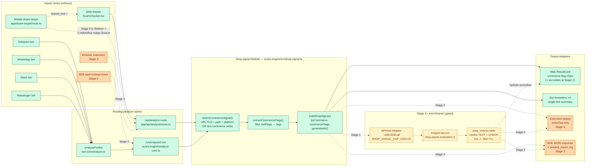

# Shop Guard v2 — implementation plan

> Supersedes `docs/plans/shop-guard.md` (commit 60857c4 on
> `claude/plan-shopping-checker-feature-3pIuF`) and its critique
> (commit 31ecada). Both v1 artifacts remain on that branch as the
> decision trail; do not edit them. Six structural decisions changed
> between v1 and v2 — see §1.
>
> Status: planning (no code shipped). Owner: brendan.

## 1. Locked decisions (changes vs. v1)

| #   | v1 said                                                     | v2 says                                                                                                                                                                                            | Why                                                                                                                                                                                                                      |
| --- | ----------------------------------------------------------- | -------------------------------------------------------------------------------------------------------------------------------------------------------------------------------------------------- | ------------------------------------------------------------------------------------------------------------------------------------------------------------------------------------------------------------------------ |
| 1   | New `packages/shop-guard/` package, pillar inside URL Guard | **Module `shop-signal` inside `packages/scam-engine/`**, peer of `charity-intent.ts`; URL Guard is one Adapter of five                                                                             | Bots call `runAnalysisCore` directly (not `/api/analyze`) — Module-in-scam-engine is the only shape that reaches every surface without route-handler duplication. Deletion test passes; sibling-package shape failed it. |
| 2   | Netcraft Threat Intel @ A$0.05–0.50/lookup, A$5/day cap     | **APIVoid Site Trustworthiness @ ~A$0.003/call, A$15/day cap**                                                                                                                                     | Netcraft has no per-call pricing in that shape (annual contracts ~US$25k+); APIVoid is fake-shop-built with published per-call rates. A$15/day = ~5× projected Stage-2 spend.                                            |
| 3   | Shop Guard as 8-PR ladder, paid feed in PR 5                | **Stage 0 first: 1 PR, ~80 LOC, A$0, no paid feed.** Stages 1 & 2 gated on real measurement data                                                                                                   | Sánchez-Paniagua 2022: 96% accuracy from 7 features, ~75% extractable from free sources. The paid feed isn't load-bearing for v0.1.                                                                                      |
| 4   | Mobile = "no DOM, weight redistributes, degraded coverage"  | **Mobile in-app-browser referrer is a first-class signal**, carried through `share-target` → `runAnalysisCore` as `referrerSource: 'instagram-inapp' \| 'tiktok-inapp' \| 'facebook-inapp' \| ...` | Cloaking research: requests without IG/TikTok referrer get 404. The victim's referrer IS the high-signal data, not missing data.                                                                                         |
| 5   | `verdict verdict_enum NOT NULL` in `shop_checks`            | **`verdict TEXT NOT NULL CHECK (verdict IN ('SAFE','UNCERTAIN','SUSPICIOUS','HIGH_RISK'))`**                                                                                                       | No `verdict_enum` type exists in this codebase (`scam_reports.verdict` is TEXT+CHECK). Match existing shape; `scam_reports` linkage only fires for the three legacy values, document don't paper over.                   |
| 6   | Standalone `/shop-check` page mentioned as v0.2 fallback    | **No standalone page, ever.** SEO via one blog post pointing into the drawer                                                                                                                       | Charity Check's standalone page is justified by a genuinely different output schema (ABN + deductibility). Commerce verdicts don't have that — they're a Verdict with extra fields. Deletion test fails.                 |

## 2. Module architecture — the Seam

### Architecture at a glance



> **Visual companion**: an editable Excalidraw version of the same diagram lives at [`assets/shop-signal-architecture.excalidraw`](./assets/shop-signal-architecture.excalidraw) (open in [excalidraw.com](https://excalidraw.com)) with a PNG preview at [`assets/shop-signal-architecture.png`](./assets/shop-signal-architecture.png). The Mermaid block above remains the source of truth — regenerate the PNG by re-running `build_shop_signal_diagram.py` (see commit message that introduced the assets) if the Mermaid changes.

**Contract this diagram encodes.** Future PRs MUST honour:

1. **shop-signal lives in `packages/scam-engine/`**, not a sibling package. Anything that introduces `packages/shop-guard/` or moves the orchestrator out of `scam-engine` violates the diagram and needs an explicit ADR before proceeding.
2. **Every Adapter consumes `AnalysisResult.shopSignal`** — chips, summary lines, popups, B2B JSON — none of them reach around the Module to call APIVoid or read `shop_checks` directly. The Module is the only place commerce-signal logic lives.
3. **Two analyze entry points (web `/api/analyze` route + `runAnalysisCore`) call the Module directly**; bots reach the Module _through_ `runAnalysisCore` via `analyzeForBot`. Don't add a third entry-point shape (a new route or a parallel orchestrator) without first migrating one of the existing two.
4. **APIVoid + `shop_checks` + Inngest are Stage 1**. Stage 0 must not write to the database, call a paid API, or emit an Inngest event. Stage 0.5 may only add the referrer-source field to the Module's input — no other shape change.
5. **Extension popup is `activeTab` at Stage 2.** `<all_urls>` (= CWS sensitive re-review) is a separate PR gated on extension activation data, not bundled into Stage 2 PR 6.

### Where it lives

```
packages/scam-engine/src/
  shop-signal.ts                  ← Module (Stage 0 / PR 1 adds)
  shop-signal-claude-prompt.ts    ← prompt variant for commerce pages
  analyze-core.ts                 ← consumes via one branch (~10 LOC change)
  __tests__/shop-signal.test.ts
```

### Interface (the contract every Adapter consumes)

```ts
// In @askarthur/types
export interface ShopSignal {
  isCommerce: boolean; // gate; false → all other fields undefined
  referrerSource?:
    | "instagram-inapp"
    | "tiktok-inapp"
    | "facebook-inapp"
    | "whatsapp-inapp";
  // ↑ Four detected in-app browsers. Anything else — direct URL bar, search
  // engine, RSS reader, external browser — yields `referrerSource: undefined`.
  // There is no "browser-direct" or "unknown-inapp" enum value; the absence
  // of the field IS the signal. Matches the shipped Zod enum in
  // packages/types/src/analysis.ts:106 — keep the two in lockstep.
  commerceFlags?: string[]; // ['no-abn-displayed', 'discount-implausible', 'expired-domain-reregistered', ...]
  domainAge?: { days: number; reregistered?: boolean } | null;
  abnPresence?: { found: boolean; matches: boolean } | null; // .com.au only
  knownInfraCluster?: { matched: boolean; clusterId?: string } | null; // Stage 1+
  paidProviderVerdict?: "safe" | "suspicious" | "risky" | null; // Stage 1+ (APIVoid)
  generatedAt: string;
}

// AnalysisResult (existing) grows one optional field
export interface AnalysisResult {
  verdict: "SAFE" | "UNCERTAIN" | "SUSPICIOUS" | "HIGH_RISK";
  // ... existing fields
  shopSignal?: ShopSignal; // optional; absent for non-commerce input
}
```

### Adapters that consume it (no new code per Adapter at Stage 0)

| Adapter              | Lives at                                       | Stage 0 behaviour                                                                                                         |
| -------------------- | ---------------------------------------------- | ------------------------------------------------------------------------------------------------------------------------- |
| Web drawer           | `apps/web/components/...ResultCard.tsx`        | Reads `result.shopSignal?.commerceFlags` and renders inline chips if present. ~15 LOC.                                    |
| Mobile share-target  | `apps/web/app/share-target/route.ts`           | Forwards `Referer` + `X-AskArthur-Inapp-Source` headers to `runAnalysisCore`. ~5 LOC.                                     |
| Bot-core             | `packages/bot-core/src/analyze.ts` (no change) | Inherits `shopSignal` field automatically; per-platform formatters get one new "shop flags" line if present (~5 LOC × 4). |
| `/api/v1/shop-check` | Stage 2                                        | Doesn't exist yet.                                                                                                        |
| Extension            | Stage 2                                        | Doesn't exist yet.                                                                                                        |

### Why this is a Module not a Pillar

The v1 plan modelled Shop Guard on Charity Check's multi-Pillar engine (Phone Footprint pattern). That shape forces:

- A sibling package (`packages/shop-guard/`) with its own orchestrator + scorer + provider-contract
- A pillar-typed result (`ShopCheckResult`) sitting alongside `CharityCheckResult` and `PhoneFootprintResult`
- A separate route-handler entry point or a "pillar-block" in the analyze response

The bot ground truth invalidates that shape: bots don't call `/api/analyze`, they call `runAnalysisCore` directly (see `packages/bot-core/src/analyze.ts`). For Shop Guard to reach bots without route-handler duplication, the orchestrator must live inside `runAnalysisCore`'s reach — i.e. inside `scam-engine` — and emit a field on `AnalysisResult`, not a parallel pillar-typed result.

The pillar-engine extraction discussion from ADR-0002 §"deferred" stays deferred — when a third caller emerges (Phone Footprint + Charity Check + something else), the shared `multi-pillar-engine` can be extracted then. Shop Signal isn't that third caller; it's a different shape (one Module, one AnalysisResult field, many Adapters).

## 3. Stage 0 — one PR, ship now

> **Status (2026-05-19): Stage 0 + Stage 0.5 both shipped.**
>
> - **Stage 0** — merged in PR [#324](https://github.com/matchmoments-admin/ask-arthur/pull/324), main commit `ac94ef9`. Detector + chip rendering + bot summary lines live behind `FF_SHOP_SIGNAL` (default OFF).
> - **Stage 0.5** — merged in PR [#325](https://github.com/matchmoments-admin/ask-arthur/pull/325), main commit `da92c01`. In-app-browser referrer wiring end-to-end (`/share-target` → `ScamChecker` → `/api/analyze` → `runAnalysisCore` → `buildShopSignal`) + persistence onto `scam_reports.analysis_result` + measurement docs.
> - **Measurement window**: starts the day `FF_SHOP_SIGNAL=true` is flipped in prod. Queries + decision tree in [`docs/ops/shop-signal-measurement.md`](../ops/shop-signal-measurement.md).
>
> **Implementation deltas from the planned scope below** (caught during build, captured here so the decision trail stays honest):
>
> - Point 1's `extractReferrerSource(headers)` became `detectInappReferrer(userAgent, referer)` in `apps/web/app/share-target/route.ts` — UA-substring detection is load-bearing, Referer is the WhatsApp-on-iOS tiebreaker.
> - Point 2's `shop-signal-claude-prompt.ts` was **not shipped**. Stage 0 deliberately reused the existing system prompt (which already covers AU commerce-scam patterns) and post-processed Claude's red-flag list via the 11-tag `COMMERCE_FLAG_TAXONOMY` instead. The prompt fork is deferred — only revisit if Stage 0 measurement returns <30% on Q2 (`shop-signal-measurement.md`).
> - Stage 0.5 also persists `shopSignal` onto `scam_reports.analysis_result` (in `storeScamReport`) so the Stage-0 measurement SQL can read against the existing v21 GIN(`jsonb_path_ops`) index without waiting for the Stage-1 `shop_checks` migration.

**Branch:** `shop-signal/stage-0` off `main`.

**Scope (~80 LOC + tests):**

1. **`packages/scam-engine/src/shop-signal.ts`** — exports:
   - `detectCommerceSignal(url, html?) → boolean` — TLD + path + known-platform-hint heuristic (Shopify generator meta, WooCommerce signature, `.shop`/`.store`/`.top` TLDs, `/cart` or `/checkout` path)
   - `extractReferrerSource(headers) → ReferrerSource` — parses `Referer` + `X-AskArthur-Inapp-Source` + User-Agent fingerprint
2. **`packages/scam-engine/src/shop-signal-claude-prompt.ts`** — variant prompt that lists the AU-specific red flags Scamwatch publishes (no ABN, multiple PayIDs, "store closing", >70% off luxury, etc.). Returns `ShopSignal.commerceFlags`.
3. **`packages/scam-engine/src/analyze-core.ts`** — branch: when `detectCommerceSignal()` is true AND `FF_SHOP_SIGNAL=true`, replace the default analyze prompt with the commerce variant; attach `shopSignal` to the result. ~10 LOC change.
4. **`apps/web/app/share-target/route.ts`** — forward `Referer` + IG/TikTok/FB in-app User-Agent fingerprint as a new header into `runAnalysisCore`. ~5 LOC.
5. **`packages/bot-core/src/format-{telegram,whatsapp,slack,messenger}.ts`** — if `shopSignal.commerceFlags?.length`, add one summary line. ~5 LOC × 4.
6. **`apps/web/components/.../ResultCard.tsx`** — render commerce-flag chips below the Verdict pill when present. ~15 LOC.
7. **`@askarthur/types`** — add Zod schema for `ShopSignal`; add to `AnalysisResult`.
8. **One env flag: `FF_SHOP_SIGNAL`** (server-only, default OFF). When OFF, the analyze-core branch short-circuits before the commerce-prompt swap. No consumer flag needed — UI just renders if present.
9. **CONTEXT.md** — add "Shop Signal" entry (peer of "Charity Intent", "Charity Check Result"). One paragraph.

**Out of scope for Stage 0:**

- No new table, no migration, no Inngest, no cron
- No paid API, no cost-brake, no `feature_brakes` row
- No new package, no admin dashboard
- No extension changes
- No B2B API
- No `/shop-check` page

**Exit criteria:**

- Build green, typecheck clean (`pnpm turbo build && pnpm turbo typecheck`)
- `pnpm --filter @askarthur/scam-engine test` passes (unit tests for `detectCommerceSignal`, `extractReferrerSource`, commerce-prompt parsing)
- Manually verified: paste a known fake-shop URL into prod analyze drawer → commerce flags render
- 30-day measurement window starts: Plausible event on every commerce-flagged analyze; Supabase ad-hoc query on `analysis_events` filtered by `text contains a URL` to estimate commerce-fraction

**Measurement targets before Stage 1 (all three must clear):**

- ≥5% of URL-bearing analyzes flagged `isCommerce: true`
- ≥30% of commerce-flagged analyzes return ≥1 red-flag
- Mobile share-target carries ≥20% of commerce-flagged volume (validates the referrer-as-signal bet)

If those don't land in 30 days, Stage 0 was the right ceiling — write a retro, don't ship Stage 1.

## 4. Stage 1 — gated on Stage-0 data (4–6 weeks later)

Only if Stage-0 measurements clear the bar above. Three PRs.

### PR 2 — `shop-signal/apivoid-adapter` (~250 LOC)

- New env var `APIVOID_API_KEY` + `SHOP_SIGNAL_CAP_USD=15` (matches the `<FEATURE>_CAP_USD` cost-brake convention shared with `REDDIT_INTEL_CAP_USD`, `PHONE_FOOTPRINT_CAP_USD`, `CHARITY_CHECK_CAP_USD` — the suffix is the `feature_brakes.feature` row key, which is `shop-signal`)
- `feature_brakes.shop_signal` row inserted by a tiny migration (one-row, idempotent)
- `packages/scam-engine/src/providers/apivoid.ts` — single-purpose Adapter: `getSiteTrustworthiness(url) → ShopSignal.paidProviderVerdict`
- `cost_telemetry` row per call, tagged `feature='shop_signal'`, `provider='apivoid'` (underscore matches the `phone_footprint` / `reddit_intel` row-key convention; the Module-name is `shop-signal` with hyphen, the DB row key is `shop_signal` with underscore — the hyphen-to-underscore conversion is a one-time mental tax)
- Brake checked at `runAnalysisCore` shop-signal branch entry (before the call) AND in the Adapter (defence in depth)
- `docs/ops/shop-signal-config.md` created with env-var table, cap derivation, flip-on checklist
- Flag: `FF_SHOP_SIGNAL_PAID_FEED` (default OFF, separate from `FF_SHOP_SIGNAL`)

### PR 3 — `shop-signal/migration-shop-checks` (~200 LOC)

- Migration (version reserved at apply time — verify against `supabase/` numbering):

  ```sql
  CREATE TABLE IF NOT EXISTS public.shop_checks (
    id              uuid PRIMARY KEY DEFAULT gen_random_uuid(),
    idempotency_key text,
    url_hash        bytea NOT NULL,
    url_normalized  text NOT NULL,
    verdict         text NOT NULL
                    CHECK (verdict IN ('SAFE','UNCERTAIN','SUSPICIOUS','HIGH_RISK')),
    composite_score smallint NOT NULL,
    signal          jsonb NOT NULL,
    request_id      text,
    source_surface  text CHECK (source_surface IN
                    ('web','extension','mobile-share','bot-telegram',
                     'bot-whatsapp','bot-slack','bot-messenger','b2b-api')),
    referrer_source text,
    evaluated_at    timestamptz NOT NULL DEFAULT now(),
    ttl_expires_at  timestamptz NOT NULL DEFAULT (now() + interval '90 days')
  );
  -- unique on idempotency_key (partial)
  -- BRIN on ttl_expires_at
  -- btree on (url_hash, evaluated_at DESC)
  -- NO HNSW, NO GIN trigram on this table (per ADR-0005)
  ```

- `upsert_shop_check(...)` RPC with `ON CONFLICT (idempotency_key) DO UPDATE` (`SECURITY DEFINER`, `SET search_path = public, pg_catalog` — see CLAUDE.md PL/pgSQL gotchas)
- `cleanup_expired_shop_checks(batch_size int, days int)` chunked retention RPC, `statement_timeout='300s'`, ≤5K rows/iter
- RLS: service-role write, no public read (closer to `verified_scams` than `phone_footprints`)
- Cron `/api/cron/shop-checks-retention` @ `45 3 * * *`
- `docs/system-map/database.md` updated with `shop_checks [hot ⚠]` row

### PR 4 — `shop-signal/inngest-and-result-card` (~300 LOC)

- Inngest function `shop-signal-paid-provider` consumes `shop.signal.evaluated.v1` event, writes `paidProviderVerdict` back via partial UPDATE through `update_shop_check_signal(...)` RPC (idempotent on `id`)
- `runAnalysisCore` emits the event after the cheap-path response. Event id = requestId for 24h dedup. Independent of `FF_ANALYZE_INNGEST_WEB`
- `Promise.allSettled` at the route level so shop-signal failure doesn't crater analyze
- Web ResultCard accordion: per-signal expandable list, "Why this verdict" expander, `/audit` grade exclusion
- One Playwright test per Verdict tier (SAFE / UNCERTAIN / SUSPICIOUS / HIGH_RISK)
- One bot-formatter test per platform asserting no crash on `shopSignal` payload

**Stage 1 measurement target before Stage 2:**

- ≥80% detection on the AU adversarial corpus from Scamwatch HTML scrape
- ≤2% false-positive on a 200-row sample of _real_ AU small-retailer traffic (not curated — sampled from `analysis_events`)
- p50 latency add to `/api/analyze` ≤ 200ms for commerce-flagged inputs
- APIVoid spend ≤ A$3/day median (well under the A$15 cap)

## 5. Stage 2 — gated on Stage-1 data (8–12 weeks later)

Two parallel PRs, both optional based on Stage-1 evidence.

### PR 5 — `shop-signal/b2b-api` (~200 LOC)

- `apps/web/app/api/v1/shop-check/route.ts` — auth via existing API-key middleware (Phone Footprint / Reddit Intel pattern)
- Tier gating: same as `scamsSearchB2bApi` flag
- Rate-limit higher than consumer surface
- One outbound `onward_report_log` row when verdict is HIGH_RISK on a URL not yet in Scamwatch's feed
- `NEXT_PUBLIC_FF_SHOP_GUARD_B2B_API` flag
- Pricing decision deferred to commercial team (probably matches Phone Footprint pricing)

### PR 6 — `shop-signal/extension-popup` (~350 LOC)

- New popup state in `apps/extension/src/entrypoints/popup/`
- `SHOW_SHOP_SIGNAL_VERDICT` handler added to existing `url-guard.content.ts` (Adapter on Module, NOT a new content script)
- **Stage-1 host permissions only: `activeTab`** — popup detail surfaced on toolbar click. No auto-overlay.
- Commerce-page DOM detector `apps/extension/src/lib/commerce-detector.ts` — two-of-three rule (schema.org Product, payment form, platform DOM marker)
- Sign request with existing `apps/extension/src/lib/sign.ts` ECDSA
- `WXT_SHOP_GUARD` build flag (matches `WXT_URL_GUARD` precedent)
- `<all_urls>` host permission is **PR 7, deferred** — only if extension data shows ≥20% activation rate on `activeTab` model. The CWS sensitive re-review is a hard blocker, not a stretch goal.

## 6. Cost model

| Stage              | Daily ceiling                   | Realistic spend                                                    | Source              |
| ------------------ | ------------------------------- | ------------------------------------------------------------------ | ------------------- |
| Stage 0            | A$0                             | A$0                                                                | No paid feed        |
| Stage 1 baseline   | A$15 (`SHOP_SIGNAL_CAP_USD=15`) | ~A$0.90/day @ 500 commerce analyses × 60% paid rate × A$0.003/call | APIVoid Growth tier |
| Stage 1 worst case | A$15 (cap)                      | ~A$1.50/day @ 1000 commerce analyses (Stage-1 100% rollout)        | Same                |
| Stage 2 with B2B   | A$15 still                      | + A$3–5/day B2B reseller margin returned via tier pricing          | Net positive on B2B |

**Cap derivation:** A$15 = 5× projected Stage-1 worst case, brake fires ~once/month under abnormal volume, leaves headroom for incident analysis. Documented in `docs/ops/shop-signal-config.md` (created in the Stage 0 pre-launch tidy PR; PR 2 lifts the SQL block into a real migration).

## 7. Flag inventory

| Flag                                | Type            | Default | Introduced     | Purpose                                                          |
| ----------------------------------- | --------------- | ------- | -------------- | ---------------------------------------------------------------- |
| `FF_SHOP_SIGNAL`                    | server          | OFF     | Stage 0 / PR 1 | Master switch — runs commerce-prompt branch in `runAnalysisCore` |
| `FF_SHOP_SIGNAL_PAID_FEED`          | server          | OFF     | Stage 1 / PR 2 | Enables APIVoid call (independent of `FF_SHOP_SIGNAL`)           |
| `SHOP_SIGNAL_CAP_USD`               | cost brake      | `15`    | Stage 1 / PR 2 | Daily cap on `feature='shop_signal'` cost telemetry              |
| `NEXT_PUBLIC_FF_SHOP_GUARD_B2B_API` | consumer        | OFF     | Stage 2 / PR 5 | Exposes `/api/v1/shop-check`                                     |
| `WXT_SHOP_GUARD`                    | extension build | OFF     | Stage 2 / PR 6 | Bundles popup + content-script handler                           |

**Emergency kill-switch without deploy:** `INSERT INTO feature_brakes (feature, paused_until) VALUES ('shop_signal', now() + interval '7 days')` flips the paid feed off; the Stage-0 free-only path still runs. (Row key uses underscore to match `phone_footprint` / `reddit_intel` precedent in `feature_brakes` + `cost_telemetry`.)

## 8. Risks

1. **False positives on legitimate AU small retailers** (legal-adjacent). Mitigation: no single signal can drive HIGH_RISK alone except Safe Browsing or `historical_reports`; FP corpus sampled from real `/api/analyze` traffic (not curated), 2% cap is hard CI gate.
2. **APIVoid coverage on AU-specific fake shops unknown** — they're a US/EU-leaning vendor. Stage 1 measurement target validates this on the AU adversarial corpus. If APIVoid hits <70% on AU shops, revisit Netcraft-or-build.
3. **Mobile in-app-browser referrer is spoofable** — the IG/TikTok in-app User-Agent fingerprint isn't a cryptographic signal. Mitigation: treat as one signal among many, never sole driver of verdict.
4. **Stage-0 measurement may show <5% commerce-fraction** — if so, the whole capability is below the value-prop threshold and we should ship a retro, not Stage 1.
5. **Extension stage-2 activeTab model may underperform** — if extension users don't click the toolbar icon, the `activeTab` ceiling is low. Plan: don't bridge to `<all_urls>` until activation data justifies the CWS re-review risk.
6. **Verdict 4-vs-3 mismatch with `scam_reports.verdict`** — `scam_reports` only allows `SAFE/SUSPICIOUS/HIGH_RISK`; `shop_checks` allows the four including `UNCERTAIN`. Linkage back to a Scam Report only fires for the three legacy values. Charity Check has the same constraint; document don't paper over.

## 9. Open questions before PR 1

> **Status (2026-05-19 evening, Stage-0 pre-launch tidy PR):** Q2 (closed by shipped measurement doc), Q3 (closed — UA list lives in `detectInappReferrer` in `apps/web/app/share-target/route.ts`), and Q4 (closed — see decision below) are resolved. Q1 partially resolved with APIVoid pricing captured in [`docs/ops/shop-signal-config.md`](../ops/shop-signal-config.md); AU IP egress confirmed not extra. Trial-key smoke test still pending, will happen in PR 2.

1. ~~**APIVoid trial sign-up** — confirm A$0.003/call rate, confirm AU IP egress isn't extra. Owner: brendan. Pre-PR-2.~~ → **Resolved 2026-05-19**: 10 credits per Site Trustworthiness call; A$0.003/call rate is the Growth-tier ($207/mo, 1M credits) equivalent. Stage 1 starting tier recommendation lives in `docs/ops/shop-signal-config.md` §3. AU IP egress is not surcharged.
2. ~~**Stage-0 measurement queries** — draft the SQL before PR 1 ships so we don't lose 30 days waiting on tooling.~~ → **Resolved 2026-05-19**: queries shipped in [`docs/ops/shop-signal-measurement.md`](../ops/shop-signal-measurement.md).
3. ~~**In-app-browser fingerprint list** — which IG/TikTok/FB User-Agent substrings?~~ → **Resolved 2026-05-19**: `detectInappReferrer()` in `apps/web/app/share-target/route.ts` matches `Instagram`, `musical_ly|TikTok`, `FBAN|FBAV`, `WhatsApp`, with Referer-host tiebreakers for the WhatsApp-on-iOS edge case.
4. ~~**Scam Report linkage decision** — accept 4-vs-3 mismatch or widen `scam_reports.verdict`?~~ → **Resolved 2026-05-19 → ACCEPT as known limitation.** `shop_checks.verdict` (4 values) and `scam_reports.verdict` (3 values) are decoupled by design: Shop Signal never writes back to `scam_reports`, so the constraint never fires. Linkage in the other direction (Scam Report → Shop Check) only matches when the verdict is one of the three legacy values. Same constraint exists for Charity Check (PR #58). Widening `scam_reports.verdict` would be a separate cross-table migration touching every code path that reads / writes the column — out of scope for Shop Signal. Documented in [CONTEXT.md](../../CONTEXT.md) under "Verdict vocabulary" alongside the existing Charity Check note.

## 10. What we explicitly are NOT building

- Standalone `/shop-check` page (deletion test fails; SEO via blog)
- New `packages/shop-guard/` package (Module belongs in `scam-engine`)
- Netcraft contract (no per-call pricing; APIVoid instead)
- Extension `<all_urls>` until extension data justifies CWS sensitive re-review
- HNSW or large GIN on `shop_checks` (per ADR-0005; sibling table if ever needed)
- Reverse-image hashing of product photos (DMCA exposure; v0.3+ if at all)
- Outbound NASC sharing beyond the single `onward_report_log` row in PR 5
- Cross-link with `/audit` in either direction (orthogonal questions)

## 11. PR dependency graph

```
Stage 0:
  PR 1 (shop-signal/stage-0) — no deps, ships against current main

Stage 1 (gated on 30-day Stage-0 measurement):
  PR 2 (apivoid-adapter) — depends on PR 1
  PR 3 (migration-shop-checks) — depends on PR 1 (uses ShopSignal Zod shape)
  PR 4 (inngest-and-result-card) — depends on PR 2 + PR 3

Stage 2 (gated on Stage-1 measurement):
  PR 5 (b2b-api) — depends on PR 4
  PR 6 (extension-popup) — depends on PR 4 (independent of PR 5)
  PR 7 (extension-all-urls) — depends on PR 6 + Stage-2 activation data
```

Total PR count to v0.1 production: **1** (Stage 0).
Total PR count to v0.2 with paid feed + DB: **4**.
Total PR count to v1.0 with B2B + extension: **6**.
Stretch CWS re-review PR: **7**.

vs. v1's 8 PRs all front-loaded before any user-visible value.

## 12. Tracking issues

Created 2026-05-19 from this plan. Diagram in §2 is the canonical architecture
reference each issue links back to. Status reflects current label.

| PR  | Issue / PR                                                                                                                              | Stage | Status                                            | Gate                                                             |
| --- | --------------------------------------------------------------------------------------------------------------------------------------- | ----- | ------------------------------------------------- | ---------------------------------------------------------------- |
| 1   | [#324](https://github.com/matchmoments-admin/ask-arthur/pull/324)                                                                       | 0     | ✅ **shipped 2026-05-19** (main commit `ac94ef9`) | —                                                                |
| —   | [#318](https://github.com/matchmoments-admin/ask-arthur/issues/318) → [#325](https://github.com/matchmoments-admin/ask-arthur/pull/325) | 0.5   | ✅ **shipped 2026-05-19** (main commit `da92c01`) | —                                                                |
| 2   | [#319](https://github.com/matchmoments-admin/ask-arthur/issues/319)                                                                     | 1     | `needs-info`                                      | Stage-0 measurement clears §3 bar (commerce %, flag %, mobile %) |
| 3   | [#320](https://github.com/matchmoments-admin/ask-arthur/issues/320)                                                                     | 1     | `needs-info`                                      | same as PR 2                                                     |
| 4   | [#321](https://github.com/matchmoments-admin/ask-arthur/issues/321)                                                                     | 1     | `needs-info`                                      | PR 2 + PR 3 land                                                 |
| 5   | [#322](https://github.com/matchmoments-admin/ask-arthur/issues/322)                                                                     | 2     | `needs-info`                                      | Stage-1 measurement gate in §4 PR 4 clears                       |
| 6   | [#323](https://github.com/matchmoments-admin/ask-arthur/issues/323)                                                                     | 2     | `needs-info`                                      | same as PR 5                                                     |

**Measurement window**: 30 days from the day `FF_SHOP_SIGNAL=true` is flipped in prod. Queries + day-31 decision tree in [`docs/ops/shop-signal-measurement.md`](../ops/shop-signal-measurement.md).

Next ready-for-agent work: gated. The 30-day Stage-0 window must clear before #319 / #320 are relabelled.
